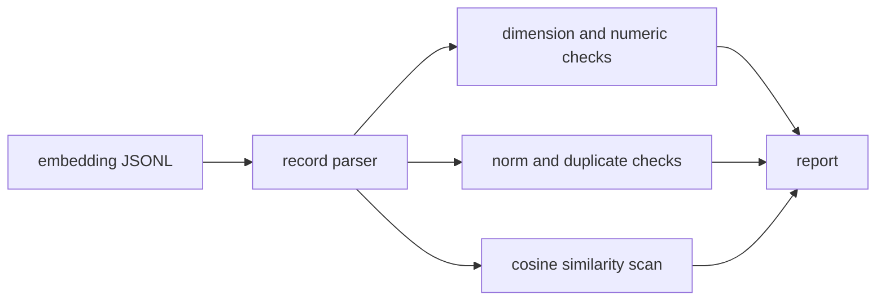

# embedding-health

`embedding-health` is a CLI for checking embedding JSONL files before they are loaded into
a vector database. It catches common quality problems that can quietly degrade retrieval:
dimension drift, zero vectors, non-finite values, duplicate vectors, norm outliers, and
near-identical vectors attached to different text.

## Why it is useful

RAG failures are often blamed on prompting when the retrieval layer is already damaged.
This tool gives you a fast local QA step for embedding exports, batch jobs, and CI checks.

## Key features

- reads JSONL records with `embedding` or `vector` fields
- validates vector dimensions and numeric values
- flags zero vectors and norm outliers
- detects duplicate rounded vectors
- checks suspicious high-cosine pairs
- emits Markdown or JSON and supports severity-based exit codes

## Installation

```bash
python -m pip install -e ".[dev]"
```

## Usage

```bash
embedding-health examples/embeddings.jsonl
embedding-health examples/embeddings.jsonl --format json
embedding-health embeddings.jsonl --similarity-threshold 0.995 --fail-on medium
python -m embedding_health --help
```

Expected JSONL shape:

```json
{"id":"doc-1","text":"reset password guide","embedding":[0.12,0.04,0.91,0.31]}
```

## Workflow



## Tests

```bash
ruff check .
pytest
python -m embedding_health --help
```

## License

MIT

