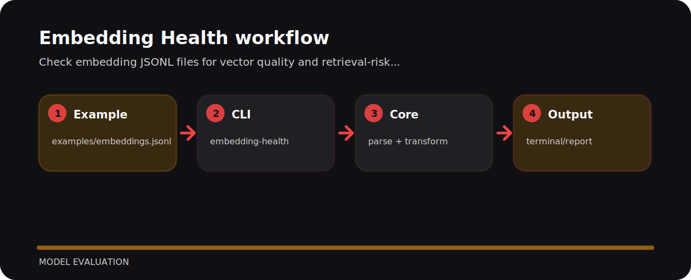

# Embedding Health


Check embedding JSONL files for vector quality and retrieval-risk issues. It is a compact working note as much as a project: commands, file map, and the reasoning are kept close together.

## Working map



## Command line

```bash
git clone https://github.com/mertefekurt/embedding-health.git
cd embedding-health
python -m pip install -e ".[dev]"
embedding-health examples/embeddings.jsonl
```

## Why this shape

A few choices worth keeping in mind:

- Designed as a focused model evaluation repo.
- Keeps setup short.
- Prioritizes readable output over infrastructure.

## Maintenance rhythm

```bash
ruff check .
pytest
python -m embedding_health --help
```
